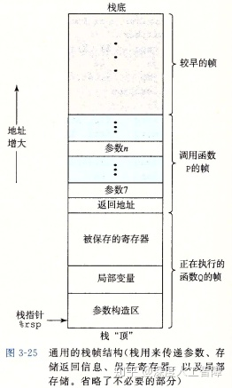
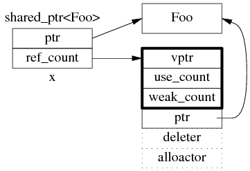

[TOC]
# C++ 和 C 的区别
* C++**几乎**是C的超集——C只有少量的特性是C++没有的（*变长数组VLA*）
<br>
* 早期C++的程序基本上可以翻译成C代码再编译——C++在语言层面上提供了更便捷的使用方法
<br>
* 面向对象和面向过程？ ——**OOP只是一种思想！并不是某种语言的特性！** C++、Java等语言只是**在语言层面很好地支持和包含了这种思想**。
<br>
* [**C也能实现封装、继承和多态！**](https://blog.csdn.net/onlyshi/article/details/81672279?utm_medium=distribute.pc_relevant_t0.none-task-blog-2%7Edefault%7EBlogCommendFromMachineLearnPai2%7Edefault-1.baidujs&depth_1-utm_source=distribute.pc_relevant_t0.none-task-blog-2%7Edefault%7EBlogCommendFromMachineLearnPai2%7Edefault-1.baidujs)

---

# 基础知识
## 1.函数的调用过程
**核心：`%rsp`栈顶指针的动态变化过程**

如函数P调用函数Q：
* P的栈帧中：
    * 首先**作为上一个函数的Callee**，P需要将**Callee寄存器中的数据push保存**
    * **作为Caller**，将自己需要保存的数据，保存在Callee寄存器中（因为这样从Q中返回时保证不会被改写）；不能保存在寄存器中的数据，就申请内存保存在栈上作为局部变量（不会对齐）。
    * 将需要传递的参数，保存在**参数寄存器**中（6个整形变量）；多出的参数也保存在栈上（内存对齐为8字节的倍数）。
    * `call Q `（**分为两步：1.将返回地址%rip压栈 2.jmp到Q**）
* Q的栈帧中：
    * 重复上述步骤；
    * 完成自己的函数任务
    * **pop恢复Callee寄存器中的数据**
    * ret指令：此时**%rsp指向的就是之前压栈的返回地址**，所以只需要从这里继续执行就完成了返回



## 2. 编译与链接
**.cc**->*预处理*->**.i**->*编译*->**.s**->*汇编*->**.o(ELF种类之一)**->*链接*->**可执行文件(ELF种类之一)**

### 目标文件(.o)
重点：
* 1. ELF Header(ELF文件头)：文件属性、系统属性、链接属性、**入口地址**
* 2. 包含当前源文件的已编译的机器代码: `.text`
* 3. 包含各种**堆上变量**：
    * 已初始化全局变量和静态变量：`.data`
    * **未初始化或初始化为0**的全局变量和静态变量：`.bss`（不占空间，使用时分配）
* 4. 符号表，**存放在程序中定义和引用的函数和非栈上变量的符号信息**：`.symtab` 
* 5. 段表（Section Header Table）：给出不同段的大小和位置等其他信息

符号表内容：
* 全局链接器符号：在**当前模块中定义，并能被其他模块引用的符号**。对应**非静态的函数和全局变量**。
* 外部链接器符号：在**别的模块中定义，并被当前模块引用的符号**。对应在**其他模块中定义的非静态的函数和全局变量**。（外部连接器符号也是全局连接器符号）
* 局部链接器符号：**只在当前模块定义和引用的符号**。对应于静态的函数和全局变量，这些符号在当前模块中任何位置都可见，但**不能被别的模块引用**。

### 链接
#### 1. 静态链接
* 1. 空间与地址分配（VMA虚拟地址空间）：
    * 扫描所有模块，收集所有符号到全局符号表
    * **分别合并所有同类别的段**，计算其中各符号在合并后的地址，填入全局符号表
* 2. 符号解析与重定位
    * 依据**重定位表**获取需要重定位的**函数和变量符号**（绝对引用）
    * 在**全局符号表**中寻找对应符号，**将其地址填入之前的“临时虚假地址”**

* 缺点：
    * **每个进程都会保留一份副本，浪费空间**
    * 如果库中有**修复或者更新，整个程序需要重新链接**

#### 2. 共享库
为了解决静态链接的缺点，我们**希望一个库可以被多个进程共享**；但是怎么复用呢？显然我们**需要将物理内存中的共享库映射到每一个进程的虚拟地址空间**。
* 1. **固定装载地址（静态共享库）**
    * 每个进程在自己的虚拟地址空间，在固定的位置分配固定大小的块，然后loader每次都将库加载到这个位置。
    * 缺点：
        * 浪费空间：不使用某些库时，也会预留其位置
        * 难以管理：越界、更新等问题
<br>

* 2. **装载时重定位**
    * 每个进程都在不同的位置开辟空间，将库映射到这个位置，十分灵活
    * 绝对地址的确定也很简单，直接加上偏移量即可（因为没有拆分合并，结构没变）
    * 缺点：
        * 假如库中的某条指令需要库中某个全局变量的绝对地址，那么不同的进程，这条指令的内容也不一样（他们被加载到的位置不同，偏移量也不同）
        * 那么**指令部分（.text段）则也需要每个进程都有自己单独的副本**，这样违背了我们的初衷（**数据.data段当然是每个进程有自己的副本**）
<br>

* 3. **地址无关代码(PIC)**（**指令中不使用绝对地址**）
    * 模块内部调用/访问数据：由于**模块内部的偏移是确定的，所以直接通过偏移来实现**
    * 模块间调用/访问数据：
        * 在 **.data段有GOT全局偏移表**，里面保存有**其它模块中变量和函数的地址**
        * **指令中会先通过偏移找到GOT中的对应条目，然后通过地址取到对应的变量和函数**

#### 3. 动态链接
* `gcc --share -fpic -o libxx.so libxx.c -ldl` 生成地址无关的共享库
* 运行程序program1：
    * 首先系统会加载program1.o，发现有.interp段，loader依据其加载**dynamic linker**，交出控制权
    * **dynamic linker**完成所有的动态链接工作（加载libxx.so到内存中，依据上述方式完成重定位等）
    * 交出控制权给program1
* 此时如果还有program2、program3需要使用libxx.so，都只需要完成后续的映射和重定位即可。

#### 4. 显式运行时链接
* `dlopen()`加载动态库、`dlsym()`依据符号获取对应函数地址指针
* `dlerror()`检查加载错误、 `dlclose`卸载动态库
---
# 一、C++关键字

## const关键字
### 1.用于修饰对象
**核心：区分顶层const和底层const**
从变量名称开始从右往左读：
```cpp
int num_1 = 10;
int num_2 = 20;

int * const a = &num_1; // a是一个常量；指针常量；指向int的指针常量
num_1= 20;// (√)
a = &num_2;// (error!)a自身不能改变，但其指向的值可以改变--顶层const

const int * b = &num_2; // b是一个指针；指向int的指针；指向const int的指针
*b = 30; // (error!)b自身可以改变，但不能通过b改变其指向的值--底层const
b = &num_1; // (√)

const int* const c = b; // c是指向const int的指针常量；c自身不能改变；也不能通过c改变其指向的值

const int& d = num_2; // 声明引用的const都是底层const--不能通过d改变其值
```
**指向常量的指针和常量引用，只是限制其本身的可参与操作，不限制其指向的对象本身是常量**


### 2.用于函数
表示该类成员函数为只读函数，不会对该对象进行修改

```cpp
class Foo
{
public:
    void setId(int newId){ id_ = newId; }
    int getId() const { return id_; }

private:
    int id_;
}
```
前提：**类在成员初始化后，```this```指针构建完成；在调用其成员函数时，会隐式地将```this```指针作为第一个参数传入:**
```cpp
this->setId(1); // == setId(this, 1);
```
**在类成员函数加上const限定，等同于给```this```指针加上const限定，表示不会通过```this```指针去改变其指向的Foo对象--即该函数为只读函数。**
```cpp
int Foo::getId() const;// == getId(const Foo* this);
```
因此，要求对某些函数进行const重载，以适应不同对象的调用。

---

## static关键字
### 1.用于修饰对象
```cpp
static global_static_var = 1;

void foo()
{
    int local_var = 0;
    static local_static_var;
}
```
```static```修饰的对象：
* 生命周期为整个程序运行期间：```foo()```之后，```local_var```被销毁；```local_static_var```依旧存在（**但是可见域依然在函数内部**）

* 储存区域为静态数据区```(rodata)```；若没有初始值则自动初始化为默认值。

* 全局静态变量在```main```函数之前已经存在；局部静态变量在运行到该代码块时生成(只初始化一次）。


### 2.用于修饰普通函数

```cpp
static void foo()
{
    int local_var = 0;
}
 ```
```static```修饰的普通函数：
* 可见域为定义该函数的文件：可以防止与他人的函数重名。普通的inline函数一般可以搭配static使用。
https://zhuanlan.zhihu.com/p/132726037

### 3.用于修饰类成员对象、函数
```cpp
class Foo {
public:
    Foo(): 
        id_(num_of_created_)
    {
        ++num_of_created_;
    }

    static int getNum() {
        return num_of_created_;
    }

private:
    int id_;
    static num_of_created_;
}

static int Foo::num_of_created_ = 0; // 该变量为Foo类共享，所以在类外定义
```
```static```修饰的类成员变量：
* 该类的所有对象共享，不依赖于对象存在

```static```修饰的类成员函数：
* 不依赖于对象存在，可直接通过类名调用；但是不能在其中使用类的非静态成员。
```cpp
int num = Foo::getNum();
 ```
---

## new/delete运算符
### 1.malloc/free
我们知道在c语言中，如果想在堆空间申请一片内存，则需要调用：
```c
void* malloc(size_t size);
```
失败会返回```NULL```；得到所需内存后，我们将其强转为所需的类型的指针；在结束使用后，需要调用：
```c
void free(void *ptr); // ptr为malloc所得到的指针
```
对申请的内存空间进行释放，避免内存泄漏。

### 2.与malloc/free的关系
```new/delete```运算符，在实现中调用了```malloc/free```，但是**通过编译器来进行了更多的更智能的操作**:
* 无需用户计算所需内存空间大小
* 转换为与所需类型严格匹配的指针
* 会调用构造/析构函数

具体过程如下所示：
* 不带有指针成员的类```class Complex```:
    * new

    * delete


* 带有指针成员的类```class String```:
    * new

    * delete


### 3. 与malloc/free的区别
通过以上可以发现，两者存在以下区别：
|特征|new/delete|malloc/free|
|:--:|:--:|:--:|
|本质|运算符|c库函数|
|申请内存所在空间|自由储存区|堆空间|
|分配成功|完整类型指针|void*|
|分配失败|bad_alloc异常|NULL|
|分配内存大小|编译器使用sizeof得出|用户计算并指定|
|处理数组|new[...] / delete[...]|用户计算并指定|
|扩充已分配的内存|无法直观处理|realloc|
|是否相互调用|可以调用|不能调用new/delete|
|分配时内存不足|客户可以定制处理|只能返回NULL|
|函数重载|允许重载<br>`operator new/delete`|不允许|
|构造/析构函数|调用|不调用|

https://www.cnblogs.com/engraver-lxw/p/8600816.html

具体的operator new重载请见[new_test.cc](./demo/new_test.cc)

### 4.sizeof关键字确定所需空间大小
可以通过```sizeof()```来确定基本类型与类类型的大小。
其中基本类型大小会根据机器平台有变；
**而类类型大小由类中所含类型和内存对齐原则决定:**
* 1. 结构体变量的起始地址能够被其最宽的成员大小整除

* 2. 结构体每个成员相对于**起始地址的偏移**能够被**编译器指定大小（默认为4）和其自身大小的最小值**整除，如果不能则在前一个成员后面补充字节

* 3. 结构体总体大小能够被最宽的成员的大小整除

```cpp
class A {// sizeof(A) = 4
    int i;
};

class B { // sizeof(B) = 8
    int i;
    char ch1;
};

class C { // sizeof(c) = 8
    int i;
    char ch1;
    char ch2;
};

class D { // sizeof(D) = 12
    char ch1;
    int i;
    char ch2;
};
 ```

### 5.malloc底层实现
* 1.当开辟的空间小于128K时，malloc 的底层实现是系统调用函数```brk()```，其主要移动指针```brk```(**Linux 地址空间中堆段的末尾地址**)
<BR>
* 2.当开辟的空间大128K时，```mmap()```系统调用函数来在**文件映射区域空间**来开辟。

---
## virtual关键字
### 1.虚函数
```cpp
Base* p = new Derived();
p->func(arg); // (*(ptr->_vptr)[n](p, arg))
```
* 运行期动态绑定：
    * 在编译期**只能确定是Base*类型的指针变量**，不能确定到底指向的是何类型；
    * 在运行期，通过**虚函数表**来决定具体执行哪一个函数
<br>
* 虚函数表(**具体实现见第三章多态部分**)
    * 虚函数表的**地址**放在实例头部；通过首部的**虚函数表指针**获得虚函数表
    * 在虚函数中查找对应的函数实现
    * 未被覆盖的虚函数，则完全保留父类的
    * 覆盖了的虚函数，替代原有父类的
    * **每个类**都有自己的虚函数表（类似```static```成员）
<br>
* 虚构造函数
    * **构造函数不能是虚函数**
        * 虚函数是在**缺少对象信息的情况下**使用的，而构造函数需要明确调用者的类型

        * 在构造函数未执行完之前，对象并没有实例化，也就没有内存空间来存放虚函数表指针
<br>
    * **析构函数一定要是虚函数**
    否则通过父类指针指向的子类，**在析构时只会调用父类的析构函数，而不会调用自己的析构函数，造成内存泄漏**。

### 2.虚继承
虚继承用于解决多继承条件下的菱形继承问题（浪费存储空间、**存在二义性**）。

### 3.虚函数表的实现（⭐️）
[虚函数实现机理（在多继承部分有错误）](https://blog.csdn.net/haoel/article/details/1948051/?utm_medium=distribute.pc_relevant.none-task-blog-baidujs_baidulandingword-3&spm=1001.2101.3001.4242)
[虚函数实现机理（目前而言最正确的）](https://zhuanlan.zhihu.com/p/41309205)

**首先明确派生类的虚函数表的生成规则：**
* *将基类虚表中的内容**拷贝一份**放到子类虚表中*。
* 如果派生类重写了基类某个虚函数，用派生类自己的虚函数替换原先基类虚函数的入口地址（重写）。
* 如果派生类增加了新的虚函数**且有多个虚表（多重继承）**，将会把**新的虚函数地址增加到第一个虚表中**，按照其在类中声明次序依次增加到虚表的最后。
* 虚表存的是虚函数指针，不是虚函数，虚函数和普通函数一样的，都是存在代码段的，只是他的指针又存到了虚表中。另外对象中存的不是虚表，存的是虚表指针。

#### 3.1 单继承时的虚函数表
```cpp
class A {
public:
    virtual func1() {}
private:
    int a_;
};

class B : public A {
public:
    virtual func1() {}
private:
    int b_;
}
```
* A和B都有自己的虚函数表，表的地址放在每个对象的头部。
* A类的虚表是编译器构建，其中放有A类所有的**虚函数**地址。B类的虚表是**先拷贝了一份A类的虚表，并对其中有重写的虚函数进行覆盖**。
* 如果B类再派生出一个C类，C类的虚表也是先先拷贝了一份B类的虚表，并对其中有重写的虚函数进行覆盖——所以**单继承的结构中，每个派生类都只会有一个虚表**，也就只会有一个虚表指针放在对象的头部。

#### 3.2 多继承时的虚函数表
```cpp
class Base1 {
public:
    virtual int func1() {}
private:
    int b1_;
};

class Base2 {
public:
    virtual int func2() {}
private:
    int b2_;
};

class Derived : public Base1, public Base2 {
public:
    virtual int func1() {}
    virtual int func2() {}
private:
    int d_;
};  
```
* 按照派生类生成虚函数表的规则，Derived类将拷贝两个父类的虚表，并且分别覆盖其中被重写的虚函数。
* 在这里，**Derived类有两个虚表指针，分别放在两个sub-object的开头**（具体见实验）
* **多继承时，不同的Base类型指针指向的地址不再固定在对象起始处**，而是有对应的偏移。(**在向上转换时（子类转化为基类），编译器会自动给转换的基类指针加上对应基类在子类对象中的偏移位置，使得基类指针指向子类对象中对应基类的虚指针所在的位置。**)
* *更深一点*：Derived中的Base1在这里是**主基类**，它的**虚表中放有Derived所有的虚函数（包括重写Base2中的函数）**，而Base2的虚表中，放的是`Thunk Derived::func2()`，即会**地址偏移到Base1的虚表中调用函数**。
---
# 二、智能指针
[陈硕大佬的文章](https://blog.csdn.net/solstice/article/details/8547547)



## 1. 线程安全
* `shared_ptr`的**引用计数本身是安全且无锁（std::atomic::fetch_add）**的，但**对象的读写则不是**，因为`shared_ptr`有两个数据成员，**读写操作不能原子化（A线程尚未修改完毕，B线程对其进行了修改）。**

* `shared_ptr`的线程安全级别和内建类型、标准库容器、`std::string`一样

## 2.特点
* `ref_count`中也有ptr指向控制块；这使得**某个`shared_ptr<Foo>`转型之后得到的指针也能正确地管理Foo对象，而不会调用错误的析构函数**；因为`ref_count`中的ptr记住了**控制块的实际类型为Foo**

* 尽量使用`make_shared()`；这样可以节省一次内存分配，把**控制块和计数器所需的内存一起分配**。


## 3.循环引用
当多个对象分别持有指向对方的智能指针，则它们永远不会析构——这就是循环引用。
### 3.1 如何解决？
将某个对象中的shared_ptr改为weak_ptr，使其不增加引用计数，类似于打破死锁的循环等待。

### 3.2 如何发现？
* 工程上：使用`valgrind`工具查看**是否存在内存泄漏**。

* 理论上：对程序中持有shared_ptr的对象进行建有向图；进行**拓扑排序来验证是否有环存在**。

---
# 三、面向对象编程

## 继承

1. 子类的初始化列表中不能直接初始化父类的成员变量
```cpp
class Base {
public:
    Base(int id) : id_(id) {}

private:
    int id_;
};

class Derived : public Base {
public:
    Derived(int id, const string& name)
        : id_(id),    // error: class ‘Derived’ does not have any field named ‘id_’
          name_(name) {

    }

private:
    string name_;
};
```
在执行子类的初始化列表之前，会先执行父类的构造函数，所以这里不能二次初始化；**想在初始化列表初始化父类的成员变量，只需要在其中调用父类的构造函数：**
```cpp
Derived(int id, const string& name)
        : Base(id),   // no error
          name_(name) {

    }
```

---
# 四、C++11新特性

* 1. 智能指针（见第二章）

* 2. `lambda`匿名函数
```cpp
// lambda func
auto func1 = [int& total, int offset](const Foo& elem)->void {
    total += elem.getVal() + offset;
};

// actually a class is generated
class _SomeCompilerGeneratedName_ {
public:
    _SomeCompilerGeneratedName_(int& total, int offset)
    : total_(total),
      offset_(offset) {

    }

    void operator() (const Foo& elem) {
        total_ += elem.getVal() + offset_;
    }
private: 
    int& total_; // Captured by ref 
    int offset_; // Captured by value
};

// equals
auto func2 =  _SomeCompilerGeneratedName_(total, offset);
func1(elem);
func2(elem);
```

