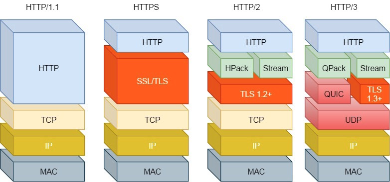

[toc]
# 计算机网络
## 在浏览器输入 URL 回车之后发生了什么？
https://blog.csdn.net/qq_38408785/article/details/100886278

---

## TCP

### 一、TCP细节
* 1. **第三次握手ACK**可以携带数据；**FIN报文段**可以携带数据
* 2. 在**连接建立后所有传送的报文ACK位必须置1**
* 3. SYN和FIN都会消耗一个序列号


### 二、TCP的各种异常情况
#### 1.三次握手异常（假设客户端为主动打开端）
* 1.第一次握手失败(客户端发送SYN，没有到达服务器)：
    * 客户端按**逐渐增大的时间间隔**进行重发，累计75s后返回```ETIMEOUT```
    * 服务端无感知
<br>
* 2.第二次握手失败（服务端发送SYN+ACK，没有到达客户端）：
    * 对于客户端而言等效于第一次失败(重发)
    * 服务器超时重传后，**发送RST，关闭连接**；客户端收到后返回```ECONNREFUSED```
<br>
* 3.第三次握手失败（客户端回复ACK，没有到达服务端）：
    * 对于服务端等效于第二次失败（未收到ACK）
    * **客户端认为连接已建立，发送数据；服务端以RST回应**
<br>
* 4.目的不可达ICMP错误
    * 客户端返回```ENETUNREACH```
<br>
* 5.客户端在**服务端accept之前断开连接**
    * 建立三次握手之后，调用accept之前，可能出现客户端断开连接的情况
    * **完成三次握手的连接会从已完成队列中移除**
    * ```accept```调用中忽略以下错误:
    ```EWOULDBLOCK, ECONNABORTED,EPROTO,EINTR```；

#### 2. **CLOSE_WAIT状态过多**怎么处理？
* 出现原因：被动关闭端接收FIN并回复ACK后，进入CLOSE_WAIT状态；发送完数据之后，被动端调用```close()```发送FIN，进入LAST_ACK状态————**CLOSE_WAIT状态过多说明被动端忙于读写或阻塞，没有调用```close()```**
<br>
* 解决办法：
    * 1. 使用完socket调用close方法；
    * 2. socket读控制，当read返回0时（读到结尾），立即close；如果read返回-1，检查error返回码；如果不是```EAGAIN```，立即close；
    * 3. 数据库连接和访问等要**设置超时时间，避免阻塞；**
    * 4. 可以设置TCP的连接时长keep_alive_time

#### 3.更多异常情况
https://www.cnblogs.com/wanpengcoder/p/5356776.html

### 三、TCP的缺点？怎么优化？
---
## HTTP
### 一、简介
* 1. HTTP是TCP/IP中的一个应用层协议；用来协议数据交换过程和数据本身的格式。
* 2. HTTP服务器**不维护客户的状态信息**，即HTTP是一个无状态的协议(`stateless protocol`)。
* 3. HTTP的格式为请求头`Header` + 主体`body`，后者又是K-V的形式

### 二、Http缺点
* 1. 无状态--双刃剑 ： 在进行有关联性操作时每一步需要重复验证状态。（**Cookies解决**）
* 2. 明文传输：GET/POST 所有的信息都没有进行加密，容易泄漏
* 3. **不安全** ：
    * 明文传输（窃听风险）
    * 连接时还不会验证双方身份（冒充风险）
    * 报文内容可能被篡改（篡改风险）

### 二、HTTP演变
#### HTTP/1.0
最基本的版本。
* HTTP/1.0规定浏览器与服务器**只保持短暂的连接**，十分影响性能。

#### HTTP/1.1特点
* 1. **默认持久连接**
    * 字段`Connection: keep-alive`

* 2. **管道传输机制**
    * 在同一个tcp的连接中可以传送多个HTTP请求和响应，但必须按照顺序.**一个包含有许多图像的网页文件的多个请求和应答可以在一个连接中传输，但每个单独的网页文件的请求和应答仍然需要使用各自的连接**
    * **队头阻塞**问题

* 3. 更加多的请求头和响应头(比如HTTP1.0没有的**Host的字段，用于访问多个虚拟站点中的一个**).

* 4. 支持多次请求，但是相似或相同的请求**并没有压缩头部**

#### HTTP/2.0（基于HTTPS）
* 1. **头部压缩**：维护一张**编号<-->头部信息**的索引表
* 2. **二进制表示**：Header和Body都用二进制表示，变为**头部信息帧和数据帧**
* 3. **数据流**：不再按顺序发送，而是**属于每个请求的数据包用独特的编号来标识**。 
* 4. **多路复用**：由于有了编号，请求可以不再串行。解决了队头阻塞问题。
* 5. **服务器推送**：刚刚建立请求时，服务器可以主动发送静态资源。
* 6. **丢包阻塞**：多个请求复用一个TCP连接，当发生丢包时，所有的HTTP请求都会阻塞

#### HTTP/3.0
* 1. **UDP协议**：使用UDP协议来避免队头阻塞和丢包阻塞
* 2. **QUIC协议**：使不面向可靠连接的UDP也能可靠地传输数据；同时减少握手次数到3次
* 3. **TLS1.3**
<br>


https://blog.csdn.net/u012813201/article/details/70211255

### 三、HTTPS
为了解决上面提到的安全问题，HTTPS协议在应用层HTTP和传输层TCP协议之间，
添加了一层**SSL/TLS**协议，很好地解决了上述问题。

**公钥加密，私钥解密；私钥签名，公钥验签。**

1. **混合加密**（解决窃听风险）：
    * 非对称加密（四次握手）
        * 客户端发起连接，三次TCP握手之后，发送**随机数N1**和密码套件
        * 服务端收到请求，回复**随机数N2**、密码套件和**CA证书**（内容经过CA私钥签名，包含**服务器的信息和公钥**）
        * 客户端收到证书，用CA公钥进行检验，通过之后**发送服务端公钥加密之后**的**随机数N3**、加密转化通知、握手摘要等
        * 服务端进行回复：加密转化通知、握手摘要
    
    * 对称加密 
       **N1 + N2 + N3 + 协商的加密算法 => 会话密钥**
        此后的会话都使用该密钥加密和解密。
<br>       

2. **摘要算法**：私钥生成内容摘要 -> 公钥验证完整性 （解决篡改风险）
3. **数字证书**：服务器向CA注册证书 -> 客户端可通过CA公钥验证身份 （解决冒充风险）


---

## IP
* 1. dotted decimal <---> hex number

---
# Linux 网络编程
## 常见Linux系统指令
netstat
top
ps 