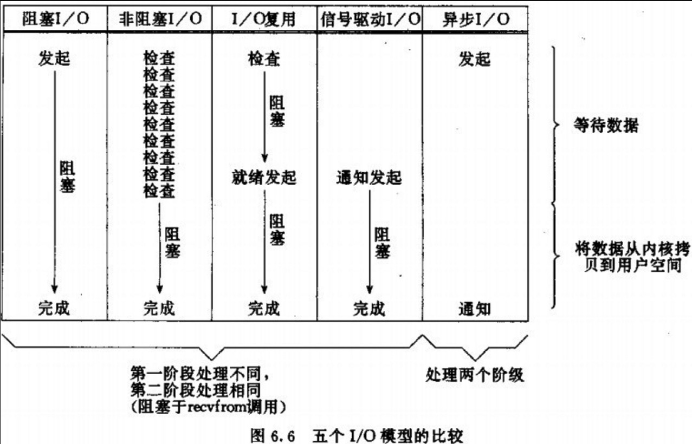

[toc]
# 进程
* **程序**，是指存放在磁盘上的编译好的二进制文件，**不占用系统资源**(cpu、内存、打开的文件、设备、锁）

* **当程序运行起来，操作系统则会为该程序分配资源，形成进程。**
* 因此，**进程是操作系统分配资源的最小单位**

## 进程的结构
### 1.PCB进程控制块
进程在Linux系统中可以具象化为```PCB进程控制块(Process Control Block)```，其是一个结构体，里面维护了一个进程的相关信息。
|PCB项|内容|
|:--:|:--:|
|进程ID|系统中每个进程有唯一的id ,在C中用pid_t表示|
|进程状态|初始、就绪、运行、挂起（阻塞）、终止|
|上下文|进程切换时需要保存和恢复的一些CPU寄存器|
|VMA|描述虚拟地址空间的信息|
|文件描述符表|包含很多指向file结构体的指针|

### 2.进程的内存空间分布
当进程被创建时，以32位系统为例，操作系统会为其分配$4G(2^{32})$的虚拟地址空间：


|区域名称|内容|
|:--:|:--:|
|内核区|系统中所有进程共享（映射到同一片物理内存）|
|环境变量及命令行参数|当前的环境变量以及```char argv[]```|
|`.stack`|局部变量、函数栈；由栈指针维护|
|`.memory_mapping`|共享的动态库、内存映射区域|
|`.heap`(created by `malloc()`)|动态申请的内存区域|
|`.bss`|未初始化的全局变量（值为0）|
|`.data`|已初始化的全局变量|
|.`text`、 `.rodata` 、`.init`|代码段，二进制机器指令;只读数据;初始化代码|

每个进程都有如上的一份虚拟地址空间：
* 1. **并不代表一个进程真正地占有了$4G$内存空间**
* 2. 寻址的时候需要由```MMU(Memory Manage Unit)内存管理单元```，将虚拟地址翻译为物理地址。

### 3.虚拟地址寻址的大概过程(三级页表为例)
虚拟地址被分为以下三部分：
|页目录偏移（10bit)|页表偏移（10bit）|物理页偏移（12bit）|
|--|--|--|
当CPU需要访问存放在虚拟地址```VA(Virtual Address)```的数据时， MMU会:
* 1. 访问保存在PTBR寄存器的页目录基址（类似数组开头）：
    页目录基址 + 页目录偏移 = 对应页表
* 2. 页表基址 + 页表偏移 = 对应页表项（标志位 + 物理页基址）
* 3. 若物理页**尚未分配，内核先在磁盘上分配对应大小的物理页**；
    若物理页**已分配尚未缓存，内核采用换出换入算法将victim page从物理内存中换出**；
    （-----以上会引发**缺页中断**----------）
    若物理页已缓存，**物理页基址 + 物理页偏移 = 数据地址（命中）**
* 4. 返回数据给CPU

### 4.进程的特点
* 1. 分配资源的最小单位（CPU，三级页表）
* 2. 进程宏观并行，微观串行（时间片）；切换（创建、销毁）时开销大
* 3. 进程间相互独立，互不影响（虚拟地址分隔/三级页表不同）
* 4. 进程间通信（```Inter—Process Communication```)复杂
* 5. 多机扩展方便

### 5.从源代码到进程
我们可以将整个过程分为两个部分：
* 1. 从**源代码**到**可执行文件**
    * 预处理、编译、汇编、链接：具体见[CPP基础知识板块](../Cpp/README.md)
<br>

* 2. 从**可执行文件**（程序）到**进程**
    * 1. 进程是**分配资源的最小单位**，那么第一步一定是分配资源：
        **在内核缓冲区建立进程对应的数据结构（PCB、多级页表）**
    * 2. 完成可执行文件到**虚拟地址空间**的映射：
        * 1. 读取**可执行文件的`Header`和段表**，将其中的每个段**映射到虚拟地址空间**中，形成多个`VMA`（即装载到虚拟地址空间）
        * 2. 这一步的**本质是在第一步分配的数据结构中进行填充**，记录下映射关系。
    * 3. 将**程序入口地址**（Header中保存）放入`%eip`寄存器中，跳转并执行，将**控制权交给进程**
        * 内核从入口地址处开始执行，进行虚拟地址寻址（具体见前）
        * **整个运行过程会不断地引发缺页异**常，从而不断地进行**物理页的换入换出**，最终达到**只加载需要的指令和数据到内存中的效果**，避免了内存不足、碎片等问题。
    
## 进程的中断、异常
前面提到了进程内存空间分为**用户空间**和**内核空间**；进程**运行在用户空间时即为用户态，在内核空间即为内核态**。

* 1. **中断、异常**是进程**从用户态转入内核态的唯一方法**。
<br>

* 2. 中断分为：
    * **外中断（和当前指令无关**）：
        * IO动作完成
        * 时间轮片结束
    * **内中断（和当前指令相关/又称为“异常”，不可被屏蔽！**）：
        * 软件中断（除数为0、越界等）
        * 缺页异常
        * 系统调用
<br>

* 3. 具体流程如下:
    * **硬件完成**：
        * 关中断（保证保存动作完整）
        * 保存断点（当前的PC寄存器内容）
        * 中断服务程序寻址（通过`Exception Table`，`Exception Number`->`Exception Handler`）

    * **中断服务程序(`Exception Handler`)完成**
        * 保存现场（某些通用寄存器的内容）
        * 开中断（可以响应更高级的中断请求）
        * 执行`Exception Handler`
        * 关中断（保证恢复动作完整）
        * 恢复现场
        * 开中断
        * 中断返回（返回原程序断点处继续执行）
        
## 进程的调度与切换
进程具有5个状态：**初始化、就绪、执行、阻塞、终结**；它是如何切换状态的？又是如何被调度的？

### 调度与切换的本质
* 1. 进程调度和切换程序是**内核程序**
* 2. **内核中保存有不同类型的进程队列**：就绪队列、阻塞队列等；每次调度时会进行**资源分配**，并依据**调度算法**调整队列。
* 3. 在**时间片用完或者进程主动让出**时，产生**中断进入内核态**；内核态中的中断服务程序，会从就绪队列中取出将执行的进程，并进行**上下文的切换、数据结构的切换**等等工作，然后**重设PC寄存器**开始继续执行新的进程

### CFS调度算法（Linux2.6.23+）
完全公平调度算法，有以下特点：
* 1. 使用**红黑树**来保存进程节点，键值为**虚拟运行时间**(`vruntime`)
* 2. `vruntime`与**实际运行时间成正比，与进程权重成反比**
* 3. **在一个调度周期内**，每个进程的`vruntime`理应相等；因此，每次只需要**选择红黑树最左边（`vruntime`最小）的节点来执行**。
* 4. 每个调度实体的`vruntime`增加速度不同，**权重越大的增加的越慢**，实际运行时间越短的`vruntime`也更小，这样就能获得更多的cpu执行时间。

---
# 线程
考虑当某个进程有A、B两个任务，其中A需要等待某种资源（IO等）；
**当所需资源没准备好时，该进程就会挂起———然而执行B任务并不需要该资源**；
所以我们需要一个**粒度更小的、能够共享已有资源的单位———线程**

## 1.独立的PCB + 共享的三级页表
Linux中，线程的本质也是进程（```light weight process```）；
这意味着**每个线程也会有自己的PCB和三级页表**
* 1.每个线程的**PCB是独立的**；因此每个线程可以单独区分开来(**内核栈：线程ID/处理器现场、栈指针**)；
* 2.**三级页表是共享的**；因此线程间可以共享资源，因为其虚拟地址空间（```.text/.data/.bss/.heap/.mmap```）相同；
* 3.线程**独享栈和寄存器**：**在线程被创建时，内核会使用mmap()在.mmap段给新线程创建其独有的栈空间**；开辟的线程栈空间一般上限为8M（线程是轻量级进程），`ulimit -s xxx`修改。

## 2.线程的优缺点
* 优点：
    * 1.提高了程序的并发性（各线程利用共享资源执行自己的任务）
    * 2.创建、切换、销毁开销小（不同额外创建虚拟地址空间）
    * 3.线程间通信简单（共享虚拟地址空间）

* 缺点：
    * 1.调试较为复杂（对应优点1）
    * 2.**在使用共享资源时必须考虑同步！（锁、条件变量、volatile + 互斥）**
---

# IPC
## 1.pipe - 匿名管道
原理：管道实为内核使用环形队列机制，借助**内核缓冲区**实现。
```cpp
int fd[2]; // 0:读端 1：写端
pipe(fd);
```
优点：简单
缺点：
* ① 只能在有血缘关系的进程间使用(他们的文件描述符表相同)
* ② 管道中数据不可反复读取。一旦读走，管道中不再存在
* ③ 采用半双工通信方式，数据只能在单方向上流动

## 2.fifo - 命名管道
FIFO 是 Linux 基础文件类型中的一种 。
但FIFO 文件在磁盘上没有数据块，仅仅用来标识**内核中一条通道**。
各进程可以打开这个文件进行 read /write 实际上是在读写内核通道 ，这样就实现了进程间通信。
```cpp
mkfifo filename// 命令行创建
int mkfifo(const char *path, mode_t mode); // 函数创建
```
优点：
* ① 简单
* ② 可在无血缘关系的进程间使用

缺点：
* ① 管道中数据不可反复读取。一旦读走，管道中不再存在
* ② 采用半双工通信方式，数据只能在单方向上流动

## 3.mmap - 共享存储映射
存储映射I/O（Memory mapped I/O） 使一个磁盘文件与存储空间中的一个缓冲区相映射。
于是当从缓冲区中取数据就相当于读文件中的相应字节；将数据存入缓冲区则类似将相应的字节写入文件。
这样，就可在不适用read和write函数的情况下，使用地址（指针）完成I/O操作。


```cpp
void* mmap(void *addr, size_t len, int prot, int flags, int fd, off_t offset);
// 返回值为void*，因为内核不知道该段内存将要存放的数据类型
```
优点：
* ① 通过指针，操作多种多样
* ② 可在无血缘关系的进程间使用

缺点：
* ① 出错概率高
* ② 小文件mmap可能造成内存浪费

特点：
* 1. 创建映射区的过程中，隐含着一次对映射文件的读操作。
* 2. 当```MAP_SHARED```时，要求：映射区的权限应小于等于文件打开的权限出于对映射区的保护。而```MAP_PRIVATE```则无所谓， 因为```mmap```中的权限是对内存的限制。
* 3. 映射区的释放与文件关闭无关。只要映射建立成功，文件可以立即关闭。
* 4. 特别注意，当映射文件大小为 0 时，不能创建映射区。**所以：用于映射的文件必须要有实际大小！！**
* 5. **```munmap```传入的地址一定是```mmap```的返回地址。坚决杜绝指针++操作。**
* 6. 文件偏移量必须为```4K```的整数倍
* 7. ```mmap```创建映射区出错概率非常高 一定要检查返回值，确保映射区建立成功再进行后续操作。

---

# 线程间同步

## 1.同步
“同步”的目的，是**避免数据混乱，解决与时间有关的错误**。实际上，不仅线程间需要同步，进程间、信号间等等都需要同步机制。
因此， **所有“多个控制流共同操作一个共享资源” 的情况**，都需要同步。

## 2.线程同步

线程同步，指一个线程发出某一功能调用时，在没有得到结果之前，该调用不返回。同时其它线程为保证数据一致性，不能调用该功能。

### 2.1 互斥量Mutex
```cpp
#include <mutex>
std::mutex mutex; // 该锁应全局共享
int global_var = 100; // 共享资源

void threadFunc() {
    // .......
    {
        // 加锁。若不成功则阻塞等待
        std::lock_guard<std::mutex> lock(mutex_); 
        // 获得锁，访问共享资源;其他线程无法取得锁
        global_var = 200;
    }
    // lock_guard析构，解锁;其他线程可以取得锁
    // .......
}
```
* 1. 每个线程在**对资源操作前都尝试先加锁**，成功加锁才能操作，**操作结束解锁**
* 2. 同一时刻，只能有一个线程持有该锁
* 3. 互斥锁实质上是操作系统提供的一把“建议锁”，**并没有强制限定**
* 4. **锁的粒度要尽量小**，在访问完成后立即解锁，减少等待时间

### 死锁
四个条件：
1. 互斥原则
2. 请求并保持
3. 已有不剥夺
4. 循环等待

#### 死锁如何检测
进程未正常往下进行时，常见有三种情况：
* 代码存在**死循环**：CPU占用率极高，状态为`R(可执行状态)`
* 进程被**IO等操作阻塞**：CPU占用率正常，状态为`S(可中断的阻塞状态)`
* 死锁：CPU占用率正常，状态为`S(可中断的阻塞状态)`；**函数调用栈处于请求锁的语句处**

#### 死锁如何解决
**破坏四个条件中任意一个**

### 2.2 读写锁rwlock
考虑某种**读多写少**的场景，如余额查询；某个线程在读共享数据的时候其他线程不能读，这显然是不合理的；原因是**没有区分访问的类型**。
更好的解决方案是：**写独占，读共享**。
```cpp
// 创建一把读写锁
pthread_rwlock_t rwlock;

// 初始化读写锁
// attr表读写锁属性，通常使用默认属性,传NULL即可
int pthread_rwlock_init(pthread_rwlock_t *lock, const pthread_rwlockattr_t *attr);

// 写加锁
pthread_rwlock_wrlock(&rwlock)；

// 读加锁
pthread_rwlock_rdlock(&rwlock);

// 解锁
pthread_rwlock_unlock(&rwlock);

```
#### 读写锁特性：
* 1. “写模式加锁”时，**解锁前，所有对该锁加锁的线程都会被阻塞**。
* 2. “读模式加锁”时，**如果线程以读模式对其加锁会成功；以写模式加锁会阻塞。**
* 3. 读锁、写锁并行阻塞，**写锁优先级高**

### 2.3 条件变量
**条件变量不是锁**，只是提供一个场所，让所有线程在此交汇；但是其本质也是对共享资源的访问，所以要搭配一把锁使用。

#### 生产者-消费者模型
既然线程是在等待条件满足，那么很容易想到**生产者-消费者模型**——生产线程产出一个产品后，则通知消费线程条件满足（**队列不为空**），消费线程则被唤醒，进行消费。

```cpp
// 显然，条件变量和锁都应该是全局共享
std::mutex mutex;
std::condition_variable cv;
std::queue<T> queue; // 共享资源

void consumer() {
    // ......
    std::unique_lock<std::mutex> lock(mutex);
    while(/* 条件不满足 */) {
        // 解锁，阻塞等待条件满足
        cv.wait(lock);
        // 当条件满足，该阻塞线程被唤醒
        // 再次检查是否满足条件
    }
    // 条件满足，获得锁，进行访问
    // ......
}

void producer() {
    // ......
    // 生产并放入队列
    queue.emplace_back(T);
    // 唤醒一个阻塞的消费线程
    cv.notify();
    // ......
}
```
#### 优点：
**相较于mutex而言，条件变量可以减少竞争。**
如直接使用mutex，**如果临界区中没有数据，消费者之间竞争mutex是无意义的**。有了条件变量机制以后，只有生产者完成生产，才会引起消费者之间的竞争。提高了程序效率。

#### 注意点：
* 1.多个消费者线程存在时，线程被唤醒，可能其它线程已经消费，条件此时并不满足，即**虚假唤醒**；应该使用```while()```来进行条件判断。
* 2.在代码块结束后将释放锁；**妥善考虑代码块结束的位置**。
* 3.可以通过生产特殊的商品来控制消费者线程退出。
* 4.当封装成```BoundedBlockingQueue```对象，在**析构时一定要唤醒所有线程并通过标志位指导其退出**，才能避免一直阻塞不能对其进行回收。

### 2.4 信号量
信号量的概念错综复杂，这里只讲自己的想法：

* 1.```Semaphore```可以初始化为任何非负整数
* 2.```Semaphore```值大于0时，线程**获取资源**，并且```--Semaphore```；等于0时，代表已经没有资源，线程挂起等待
* 3.当线程使用完资源之后，```++Semaphore```。

* 4.**资源可以是访问临界区的权限（取完后不能再进入），也可以是共享资源的个数（取完后不能再取出）**

根据上面的分析，信号量有下列用途：
* 1.初始化为1：此时相当于互斥锁
* 2.初始化为非负整数N：代表有N个线程可以访问临界区/有N个共享资源可以取用

更多的细节参考：
https://zhuanlan.zhihu.com/p/112173283

---

# 五种I/O模型
I/O是指我们需要从磁盘、网络、内存等容器中读取或写入数据。（下面以`read()`读取网络数据为例）
## 1.阻塞IO
这是一种最普通的IO：我们调用read()之后，**如果没有数据准备好，我们将会阻塞等待**——本线程会**挂起直到有数据到来**。

* 显然这样的效率并不高，因为如果长时间无数据到来，我们的线程就一直处于空闲状态。

## 2.非阻塞IO
我们可以在创建fd时就指定其为`Non-blocking`，也可以在创建之后通过fctrl()将其设置为非阻塞；
但都只为了同一个效果：**在数据未准备好时，直接返回-1，并且以错误码形式来表示读取的结果**（通常为`EAGAIN/EWOULDBLOCK`）

* 这样我们无需阻塞等待数据到来；但显然我们更不希望错过这个数据。因此，在这种模型中我们需要以**忙轮询**的方式，
不断查看数据是否到来。
* 我们可**以在两次轮询之间处理一些其他的任务**，但这样由于可能**不能及时读取数据而造成吞吐量下降**。

***如果只使用上述两种简单模型，那么对于多个连接我们就需要创建多个进程/线程来进行处理***

## 3.IO多路复用（⭐️）
能不能在一个线程当中，方便地去轮询多个fd呢？
Unix当中提供了`select`, `poll`, `epoll`三个函数。（三者具体区别见下一部分总结）
* 它们**通过把多个I/O的阻塞复用到同一个函数的阻塞上，同时监控多个fd的状态，并且在有可写/可读事件到来时告知用户**，使得用户可以**在单线程的情况下**对多个fd进行IO操作。
* 它的**优势并不在于处理单个连接时效率更高**，而是在于**能在单线程中同时监听多个fd**，避免了大量的系统开销。


## 4.信号驱动IO 
前面的三个模型，我们都需要自己去等待数据到来（不论是阻塞还是轮询）。
信号驱动模型解决了这个问题———它是通过注册信号处理函数`handler()`，在数据到来时内核会发送信号，程序就能在`handler()`中进行数据的读取
* 线程**无需等待或轮询数据的状态，而是可以完成其他任务**，在信号到来时自动处理
* 这是类似于**回调**的概念

## 5.异步IO（aio、io_uring、DMA）
上述的模型中，无论在数据到来前是哪种方式，**在读取数据时它们总是阻塞的**；在数据从内核缓冲区被搬移到用户缓冲区的这段时间内，该线程不能做其他事情。
异步IO模型中，我们只需要发起一个读请求（指定好需要缓存数据的位置），就可以继续完成自己的任务了，**内核会在数据读取完成后再通过信号通知程序**。

### 五种IO模型的对比


---

# `select()`, `poll()`, `epoll()`的区别
## 三者都是**IO多路复用**所用的函数
依据前面的模型分析，**IO多路复用**需要完成如下的一些事情：
* 1. 用户态如何传递存有`fd`的数据结构到内核态
* 2. 内核如何判断`fd`可读可写
* 3. 内核判断有`fd`可读可写之后，监控函数如何处理
* 4. 监控函数处理之后，用户态程序如何获取有哪些`fd`可读可写
* 5. 如何进行下一次监控循环

## `select` 
* 1. 准备三个`FD_SET`(内核限制最大为1024):
```cpp
int select(int nfds, fd_set *readfds, fd_set *writefds, fd_set *exceptfds, struct timeval *timeout);
```
从用户态**全部拷贝**到内核。

**此时若没有数据到来，该进程A会被就绪队列中取出，加入到每个被监听的fd的`Wait Queue`中；进入阻塞状态**
<br>

* 2. 此部分**完全在内核态执行**：
    * 网卡接收或发送网络信息时，会**产生中断通知CPU**（TODO:中断合并、轮询等等）
    * CPU在**每个指令周期末尾检查中断标志寄存器**，响应中断，执行**中断服务程序**
    * 中断服务程序中，先处理数据，然后会**检查Socket是否满足可读可写条件**；满足条件后，中断服务程序将进程A从**所有`Wait Queue`中**取出，放入就绪队列
<br>

* 3. 进程A继续执行：`select`在内核态中，将**就绪的fd对应的位置为1**；将
三个`FD_SET`全部再次拷贝到用户态，返回就绪的总个数
<br>

* 4. 用户程序需要**依次遍历**每个`fd`，判断其是否就绪

* 5. 由于`FD_SET`已经被修改，我们需要重新设置它们，进行**下一次的拷贝**和监听

## `poll`
* `poll`使用了如下的结构体来代替`BitMap`: 
```cpp
struct pollfd {
    int fd; /* 文件描述符 */
    short events; /* 监控的事件 */
    short revents; /* 监控事件中满足条件返回的事件 */
};
```
* 使用**链表结构**代替`FD_SET`，因此**解除了1024的限制**

* 内核态中，`poll`修改的是`short revents`；因此**无需传入传出参数**

* `poll`和`select`没有本质的区别，都需要**遍历查询**；时间复杂度为O(n)

## `epoll`
* 1. 执行`epoll_create()`，在**内核专属于`epoll`的高速cache区**中，建立**红黑树(`rbtree`)**和**就绪链表(`rdlist`)**；用户态传入的`fd`将被放到`rbtree`中
    * **`epoll_create()`会返回一个`epoll_fd`，它也有自己的等待队列**
    * 添加节点时，`epoll`还向**中断处理程序**注册了该`fd`的回调函数(*内核在检测到某`fd`就绪时则调用该回调函数，其将`fd`放到`rdlist`*)。
    * **所有被监听`socket`的`Wait Queue`中不再引用进程，而是引用`rdlist`**
    * `epoll_fd`的`Wait Queue`中**引用该进程A**
<br>

* 2. 此部分**完全在内核态执行**：
    * 网卡接收或发送网络信息,**产生中断通知CPU**
    * CPU响应中断，执行**中断服务程序**
    * 中断服务程序中，先处理数据，然后会**检查Socket是否满足可读可写条件**；满足条件后，中断服务程序将该`fd`放入`rdlist`中（回调函数）；**将进程A从`epoll_fd`的`Wait Queue`中**取出，放入就绪队列
<br>

* 3. 进程A继续执行，**`epoll`将`rdlist`中的`fd`拷贝到用户态（少量拷贝）**，返回就绪的`fd`个数

* 4. 用户**无需重新加以判断**，直接遍历返回的就绪列表即可

* 5. 内核中的`rbtree`**仍然有效**（如果需要可以使用`epoll_ctl()`改动)，**下一次监控无需再次进行拷贝**
<br>

###  `epoll`的优势特点
#### 本质：
* 1.减少**用户态和内核态之间的文件句柄拷贝**；
* 2.减少**对就绪`fd`的遍历**；

#### LT/ET
* 1. `epoll_wait()`在返回用户态时，会清空`rdlist`
* 2. 下一轮监控时，`epoll_wait()`会检查这些socket，**判断其是否有未处理完的事件，并且依据其LT/ET属性，决定是否将它放回rdlist中便于下次返回**
* 3. 因此，`ET`模式的`fd`，**除非有新的中断程序到来（就绪状态发生改变）**，否则不会再次添加到`rdlist`中
---
# Linux常用系统相关指令
## 查看CPU和内存使用
* **top** 查看CPU
* **free** 查看内存使用情况

##  **进程相关**
* **ps -l** 查看当前bash下的进程
* **ps aux** 查看所有进程
* **pstree [PID]** 查看PID的进程关系
* **kill -[SIG] [PID]** 向PID进程发送SIG

---
# Linux文件管理
## 两个重要的结构：
### 1. 索引节点(inode)
* 与磁盘文件一一对应
* 自身也保存在磁盘上

### 2. 目录项(dentry)
* 结构为：**文件名(14B) + 索引节点*指针*(2B)**
* 是内核维护的一个数据结构，**缓存在内存**中

## 进程打开文件
* 内核中维护有一个包含**所有打开文件**信息的**打开文件表**

* `open()`会根据文件名搜索目录，找到**目录项**并复制到**打开文件表**

* `open()`会返回**指向该目录项的指针**，在**进程打开文件表**中与**文件描述符**形成`K-V`对)；所有的I/O操作通过**文件描述符**完成

* 当**另一进程也打开同一文件**时，不过是将该目录项指针复制到其进程打开表中，并**增加目录项中的文件打开计数**

## 文件共享
### 硬链接
* 多个目录项中的「索引节点**指针**」指向一个**索引节点**，也就是指向同一个`inode`

* 索引节点中保存有「**链接计数**」，当**所有的硬链接被删除**，该文件就**被标识为可删除**

### 软链接
* 软链接是**额外创建了一个`Link`文件**，有属于自己的`inode`和目录项；文件的内容**为被链接文件的路径名**

* 当某个文件被删除，其**软链接仍旧有效，不过会访问失败**