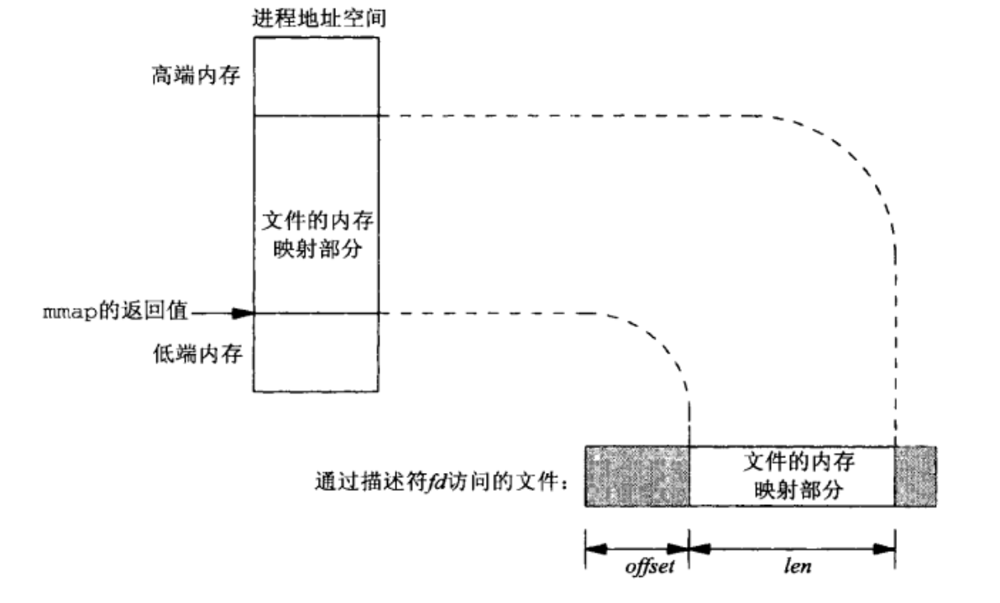

# IPC

## 1.pipe - 匿名管道
原理：管道实为内核使用环形队列机制，借助内核缓冲区实现。
```cpp
int fd[2]; // 0:读端 1：写端
pipe(fd);
```
优点：简单
缺点：
* ① 只能在有血缘关系的进程间使用
* ② 管道中数据不可反复读取。一旦读走，管道中不再存在
* ③ 采用半双工通信方式，数据只能在单方向上流动

## 2.fifo - 命名管道
FIFO 是 Linux 基础文件类型中的一种 。
但FIFO 文件在磁盘上没有数据块，仅仅用来标识内核中一条通道。
各进程可以打开这个文件进行 read /write 实际上是在读写内核通道 ，这样就实现了进程间通信。
```cpp
mkfifo filename// 命令行创建
int mkfifo(const char *path, mode_t mode); // 函数创建
```
优点：
* ① 简单
* ② 可在无血缘关系的进程间使用

缺点：
* ① 管道中数据不可反复读取。一旦读走，管道中不再存在
* ② 采用半双工通信方式，数据只能在单方向上流动

## 3.mmap - 共享存储映射
存储映射I/O（Memory mapped I/O） 使一个磁盘文件与存储空间中的一个缓冲区相映射。
于是当从缓冲区中取数据就相当于读文件中的相应字节；将数据存入缓冲区则类似将相应的字节写入文件。
这样，就可在不适用read和write函数的情况下，使用地址（指针）完成I/O操作。



```cpp
void* mmap(void *addr, size_t len, int prot, int flags, int fd, off_t offset);
// 返回值为void*，因为内核不知道该段内存将要存放的数据类型
```
优点：
* ① 通过指针，操作多种多样
* ② 可在无血缘关系的进程间使用

缺点：
* ① 出错概率高
* ② 小文件mmap可能造成内存浪费

特点：
* 1. 创建映射区的过程中，隐含着一次对映射文件的读操作。
* 2. 当```MAP_SHARED```时，要求：映射区的权限应小于等于文件打开的权限出于对映射区的保护。而```MAP_PRIVATE```则无所谓， 因为```mmap```中的权限是对内存的限制。
* 3. 映射区的释放与文件关闭无关。只要映射建立成功，文件可以立即关闭。
* 4. 特别注意，当映射文件大小为 0 时，不能创建映射区。**所以：用于映射的文件必须要有实际大小！！**
* 5. **```munmap```传入的地址一定是```mmap```的返回地址。坚决杜绝指针++操作。**
* 6. 文件偏移量必须为```4K```的整数倍
* 7. ```mmap```创建映射区出错概率非常高 一定要检查返回值，确保映射区建立成功再进行后续操作。
